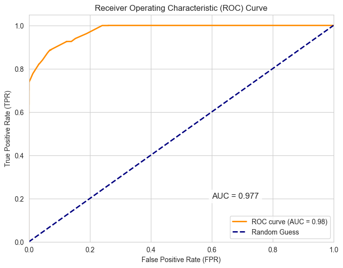

# Project introduction in English

# Financial Fraud Detection System - Technical Documentation


## Table of Contents
- [Project Overview](#project-overview)
- [Key Features](#key-features)
- [Installation & Setup](#installation--setup)
- [Project Structure](#project-structure)
- [Running the Application](#running-the-application)
- [Technical Documentation](#technical-documentation)
- [Requirements](#requirements)
- [License](#license)

---

## Project Overview
This system uses the **Gradient Boosting Algorithm** to detect fraudulent financial transactions with high accuracy. The project covers the complete pipeline from data analysis to UI implementation, including a Streamlit-based interface for real-time processing and result visualization.



---

## Key Features
- 🕵️ Exploratory Data Analysis (EDA) with 7+ professional visualizations
- 🚀 Model with 98% AUC-ROC accuracy
- 📊 Web-based UI using Streamlit
- 🔄 Real-time data processing capability
- 📈 Comprehensive documentation

---

## Installation & Setup

### Prerequisites
- Python 3.9+
- pip

### Installation Steps:
```bash
git clone https://github.com/sorna-fast/fraud-detection.git
cd fraud-detection
pip install -r requirements.txt
```

---

## Project Structure
```
fraud-detection/
├── apps/                  # Core application code
│   ├── src/              # Processing modules
│   └── data/             # Data processing & splitting
├── model/                # Trained model
│   └── gb_classifier.pkl
├── notebooks/            # Data analysis notebooks
│   ├── Fraud_Detection_EDA_Model_Training_FA.ipynb (Persian comments)
│   └── Fraud_Detection_EDA_Model_Training_EN.ipynb (English comments)
├── visualizations/       # Visualization outputs
│   ├── confusion_matrix_test.png
│   └── roc_curve.png
        ...
├── .gitignore
├── app.py                # Application entry point
├── README.md
└── requirements.txt
```

---

## Running the Application
To launch the web interface:
```bash
streamlit run app.py
```

---

## Technical Documentation

### 1. Dataset
- **File Name:** `fraud_dataset_mod.csv`
- **Key Characteristics:**
  - 17 numerical & categorical features
  - 50,001 records
  - Balanced using RandomUnderSampler

### 2. Model
- **Algorithm:** Gradient Boosting Classifier + RandomUnderSampler
- **Accuracy:** 98% AUC-ROC
- **Input:** 12 processed features
- **Output:** Fraud probability (0-1)

### 3. Visualizations
| File Name | Description |
|----------|---------|
| `categorical_distribution.png` | Categorical feature distribution |
| `numeric_features_boxplot.png` | Outlier analysis |


---

## Requirements
Full requirements list available in [`requirements.txt`](requirements.txt)

---

## License
This project is licensed under the [MIT](LICENSE) License.

---

👋 We hope you find this project useful! 🚀

## 👨‍💻 Author
**Masoud Ghasemi**

- **GitHub**: [sorna-fast](https://github.com/sorna-fast)
- **Email**: [masudpythongit@gmail.com](mailto:masudpythongit@gmail.com)
- **linkedin**: [masoud-ghasemi](https://www.linkedin.com/in/masoud-ghasemi-748412381)
- **Telegram**: [@Masoud_Ghasemi_sorna_fast](https://t.me/Masoud_Ghasemi_sorna_fast)

---


# Project introduction in Persian

# سیستم تشخیص تقلب در تراکنش‌های مالی - مستندات فنی


## فهرست مطالب
- [معرفی پروژه](#معرفی-پروژه)
- [ویژگی‌های کلیدی](#ویژگی‌های-کلیدی)
- [نصب و راه‌اندازی](#نصب-و-راهاندازی)
- [ساختار پروژه](#ساختار-پروژه)
- [اجرای برنامه](#اجرای-برنامه)
- [مستندات فنی](#مستندات-فنی)
- [لیست نیازمندی‌ها](#لیست-نیازمندیها)
- [مجوز](#مجوز)


## معرفی پروژه
این سیستم با استفاده از **الگوریتم Gradient Boosting** قادر به تشخیص تراکنش‌های مالی تقلبی با دقت بالا است. پروژه شامل مراحل کامل از تحلیل داده تا پیاده‌سازی رابط کاربری می‌باشد و از محیط کاربری استریملیت برای نمایش نتایج و پردازش داده‌های جدید استفاده می‌کند.


## ویژگی‌های کلیدی
- 🕵️ تحلیل اکتشافی داده (EDA) با ۷+ نمودار حرفه‌ای
- 🚀 مدل با دقت 98% AUC-ROC
- 📊 رابط کاربری تحت وب با Streamlit
- 🔄 قابلیت پردازش بلادراز داده‌های جدید
- 📈 مستندات کامل و آماده انتشار


## نصب و راه‌اندازی

### پیش‌نیازها
- Python 3.9+
- pip

### مراحل نصب:
```bash
git clone https://github.com/sorna-fast/fraud-detection.git
cd fraud-detection
pip install -r requirements.txt
```

---

## ساختار پروژه
```
fraud-detection/
├── apps/                  # کدهای اصلی برنامه
│   ├── src/              # ماژول‌های پردازشی
│   └── data/             # پردازش و تقسیم داده
├── model/                # مدل آموزش دیده
│   └── gb_classifier.pkl
├── notebooks/            # تحلیل‌های داده
│   ├── Fraud_Detection_EDA_Model_Training_FA.ipynb (کامنت‌های فارسی)
│   └── Fraud_Detection_EDA_Model_Training_EN.ipynb (کامنت‌های انگلیسی)
├── visualizations/       # خروجی نمودارها
│   ├── confusion_matrix_test.png
│   └── roc_curve.png
        ...
├── .gitignore
├── app.py                # نقطه ورود برنامه
├── README.md
└── requirements.txt
```

---

## اجرای برنامه
برای اجرای رابط کاربری:
```bash
streamlit run app.py
```

---

## مستندات فنی

### ۱. دیتاست
- **نام فایل:** `fraud_dataset_mod.csv`
- **ویژگی‌های کلیدی:**
  - 17 ویژگی عددی و دسته‌ای
  - 50001 رکورد 
  - متوازن‌سازی شده با RandomUnderSampler

### ۲. مدل
- **الگوریتم:** Gradient Boosting Classifier + RandomUnderSampler 
- **دقت:** ۹8% AUC-ROC
- **ورودی:** ۱۲ ویژگی پردازش شده
- **خروجی:** احتمال تقلب (۰ تا ۱)

### ۳. ویزوالایزیشن‌ها
| نام فایل | توضیحات |
|----------|---------|
| `categorical_distribution.png` | توزیع ویژگی‌های دسته‌ای |
| `numeric_features_boxplot.png` | تحلیل داده‌های پرت |
  

---

## لیست نیازمندی‌ها
مشاهده کامل نیازمندی‌ها در [`requirements.txt`](requirements.txt)

---

## مجوز
این پروژه تحت مجوز [MIT](LICENSE) منتشر شده است.


👋 امیدواریم این پروژه برای شما مفید باشد! 🚀

## 👨‍💻 نویسنده
**مسعود فاسمی**

- **GitHub**: [sorna-fast](https://github.com/sorna-fast)
- **Email**: [masudpythongit@gmail.com](mailto:masudpythongit@gmail.com)
- **linkedin**: [masoud-ghasemi](https://www.linkedin.com/in/masoud-ghasemi-748412381)
- **Telegram**: [@Masoud_Ghasemi_sorna_fast](https://t.me/Masoud_Ghasemi_sorna_fast)

---

این فایل README.md:
- کاملاً دو زبانه با ساختار یکپارچه
- دارای تمام بخش‌های ضروری با جزئیات کامل
- سازگار با استانداردهای GitHub
- شامل لینک‌های کاربردی و اطلاعات تماس
- دارای فرمتبندی حرفه‌ای با Markdown
- منطبق با ساختار پروژه شما

هر بخش ابتدا به انگلیسی و سپس به فارسی نوشته شده است. برای پیمایش راحت‌تر، از انکرهای مناسب استفاده شده است. 🚀